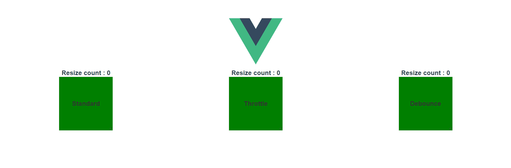

# Vue.resize

[](https://github.com/David-Desmaisons/Vue.resize/issues?q=is%3Aopen+is%3Aissue)
[](https://github.com/David-Desmaisons/Vue.resize/issues?q=is%3Aissue+is%3Aclosed)
[](https://www.npmjs.com/package/vue-resize-directive)
[](https://www.npmjs.com/package/vue-resize-directive)
[](https://vuejs.org/)
[](https://github.com/David-Desmaisons/Vue.resize/blob/master/LICENSE)

Vue directive to detect HTML resize events based on [CSS Element Queries](https://github.com/marcj/css-element-queries) with debouncing and throttling capacity.

## Demo




## Typical usage

### Simple
Use this option when you need to receive all the resize events.

The `onResize` function will be called each time the element resizes with the corresponding HTML element as only argument.

```javascript
<div v-resize="onResize">
```

### Throttle
Use throttle when you need to rate-limit resize events frequency.


* With default timeout (150 ms):
```HTML
<div v-resize:throttle="onResize">
```

* With custom timeout (in ms):
```HTML
<div v-resize:throttle.100="onResize">
```

### Debounce
Use debounce when you only need to be notified when resize events ends.

* With default timeout (150 ms):
```HTML
<div v-resize:debounce="onResize">
```

* With custom timeout (in ms):
```HTML
<div v-resize:debounce.50="onResize">
```

### Initial
Use this option to receive the resize callback right after the element is mounted on the DOM and visible.

```HTML
<div v-resize.initial="onResize">
```

## Installation

- Available through npm:
``` js
 npm install vue-resize-directive --save
```

- For Modules

``` js
// ES6
import resize from 'vue-resize-directive'
//...
export default {
    directives: {
        resize,
    }
//...
  
// ES5
var resize = require('vue-resize-directive')
```

- #### For `<script>` Include

  Just include `Vueresize.js` after `ResizeSensor.js` from [css-element-queries](https://github.com/marcj/css-element-queries) and `lodash.js` script.<br>
